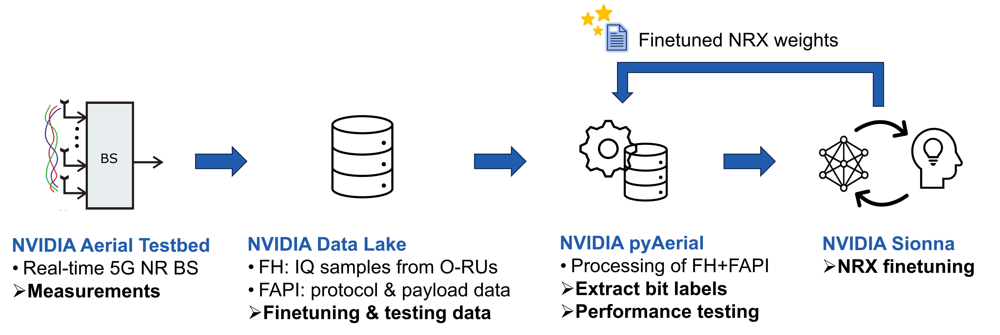

# Site-Specific Training with Real-World 5G NR Measurements

Over-the-air measurements are essential to evaluate the real-world performance of machine learning (ML) algorithms.
To this end, this codebase implements the site-specific training workflows used in [1] and [2] to finetune and evaluate three receiver architectures on real-world measurement data from the 5G NR testbed at ETH Zurich:

- **Neural Receiver (NRX):** a fully-tunable receiver presented in [3] that implements data detection with a neural network.
- **Model-Driven Neural Receiver (MDX):** a low-complexity, model-driven neural receiver presented in [4] that combines conventional receiver algorithms with a compact neural network.
- **Deep-Unfolded Interleaved Detection and Decoding (DUIDD) Receiver:** a model-based receiver presented in [5] that uses deep unfolding to train hyperparameters of a classical iterative detection and decoding (IDD) receiver.

This codebase provides the pipeline to pretrain and finetune these existing receivers. It extracts Physical Uplink Shared Channel (PUSCH) slot samples from [NVIDIA Aerial Data Lake](https://docs.nvidia.com/aerial/cuda-accelerated-ran/25-2/aerial_data_lake/index.html), obtains ground-truth coded-bit labels from decoded payload bits and the associated hybrid automatic repeat request (HARQ) retransmission history, produces reusable finetuning data, finetunes receiver parameters, and evaluates all receivers on real-world measurement samples.

This codebase and the underlying [datasets](datasets.md) support site-specific finetuning with single- and dual-layer transmissions. They also support site-specific parameter adaptation through covariance matrix estimation for LMMSE channel estimation.

A representative runtime complexity comparison is beyond the scope of this work because the MDX and DUIDD receivers are available only as TensorFlow implementations, whereas the NRX is compiled into a real-time TensorRT engine.

## Finetuning Overview



Receiver models are first pretrained on synthetic channel data to learn general signal-processing behavior. Since finetuning starts from an existing pretrained receiver, even short training times and small datasets already achieve significant error-rate performance improvements [6].

The figure above illustrates the site-specific finetuning workflow, which starts with measurements from the standard-compliant 5G NR testbed at ETH Zurich [7], that builds upon the NVIDIA Aerial Testbed (ATB) software platform. We refer to [8] for more information about [NVIDIA Aerial](https://docs.nvidia.com/aerial/cuda-accelerated-ran/25-2/), [pyAerial](https://docs.nvidia.com/aerial/cuda-accelerated-ran/25-2/pyaerial/index.html), and [Data Lake](https://docs.nvidia.com/aerial/cuda-accelerated-ran/25-2/aerial_data_lake/index.html). The 5G NR testbed records over-the-air PUSCH measurements which are stored in [NVIDIA Data Lake](https://docs.nvidia.com/aerial/cuda-accelerated-ran/25-2/aerial_data_lake/index.html). The repository utilizes datasets from different measurement campaigns across several deployment scenarios to extract data for offline receiver finetuning. Finetuned receivers are then also evaluated on real-world measurement datasets. All of the datasets that are used in the experiments are publicly available for download. Further descriptions and download links are provided in the [Measurement Datasets](#sec-dt) section.

We refer to the accompanying research paper [1] for additional details on the testbed, deployment scenarios, dataset construction, finetuning configurations, evaluation metrics, and site-specific parameter adaptation experiments.

## Codebase Structure

The three receiver architectures investigated in this work are all based on the neural receiver codebase [NVlabs/neural-rx](https://github.com/NVlabs/neural-rx) published with [6]. We implement our modifications for site-specific finetuning on top of each pre-existing codebase, as follows:

| Directory | Inherited from | Our extensions | Further documentation |
| --- | --- | --- | --- |
| [`neural_rx`](neural_rx/) | Fork of [NVlabs/neural-rx](https://github.com/NVlabs/neural-rx). | Testbed-compatible configuration files; extraction of Data Lake slot samples into TFRecord files; site-specific finetuning; NVIDIA pyAerial-based receiver evaluation. | [`neural_rx/README.md`](neural_rx/README.md) |
| [`mdx`](mdx/) | Fork of [Mahdi-Abdollahpour/mdx](https://github.com/Mahdi-Abdollahpour/mdx). | Testbed-compatible configurations; site-specific finetuning; NVIDIA pyAerial-based evaluation. | [`mdx/README.md`](mdx/README.md) |
| [`nrx_duidd`](nrx_duidd/) | Adapted from [IIP-Group/DUIDD](https://github.com/IIP-Group/DUIDD); integrated in [NVlabs/neural-rx](https://github.com/NVlabs/neural-rx) for 5G NR PUSCH compliance. | Testbed-compatible configuration files; fixed-configuration site-specific finetuning; NVIDIA pyAerial-based evaluation; and noise-corrected spatial, frequency, and temporal covariance estimation for site-specific LMMSE channel estimation. | [`nrx_duidd/README.md`](nrx_duidd/README.md) |

### Relevant Directories

The following directories are present as subdirectories in each receiver-specific module (`neural_rx/`, `mdx/`, and `nrx_duidd/`):

- `config/`: experiment configurations defining the channel model, receiver architecture, training schedule, and training dataset.
- `scripts/`: provided scripts for data extraction, training and evaluation.
- `weights/`: pretrained and finetuned receiver weights and covariance matrices.
- `eval_timestamps/`: timestamps to select slot samples for deterministic performance evaluation.
- `logs/` and `results/`: training logs and experiment output directories.
- `utils/`: helper scripts and classes which load the configurations and build the receiver models.
- `notebooks/`: contains the tutorial notebooks with step-by-step guides for the experiments.

## Research Workflow

Our site-specific training experiments for all three receiver architectures implement the following steps:

1. **Pretrain a receiver on synthetic channels** using the 5G NR slot configuration used by the 5G NR testbed at ETH Zurich. Use the script `train_neural_rx.py` with a configuration that uses randomized 3GPP UMi channels implemented in Sionna.
2. **Extract finetuning data from real-world measurements.** Use measurement data stored in the ClickHouse database (a core component of NVIDIA Data Lake) and run the [`neural_rx/create_tfrecord_from_data_multicell.py`](neural_rx/scripts/create_tfrecord_from_data_multicell.py) script for data extraction. The script retrieves the designated finetuning slots, reconstructs their coded-bit labels, and writes the appropriate TFRecord files to [`finetuning_datasets`](finetuning_datasets). Alternatively, download the existing pre-extracted files for the corresponding datasets as described in the [Measurement Datasets](#sec-dt) section.
3. **Finetune from the pretrained weights.** Run the corresponding training script `train_neural_rx.py` in each receiver directory with a configuration that sets `channel_type = 'Datalake'` and assigns `datalake_tf_fn` to the extracted TFRecord. Joint single- and dual-layer NRX configurations use compatible TFRecords from both transmission configurations.
4. **Evaluate on real-world measured data.** Evaluation scripts that use real-world data are stored within the `scripts/` folder of each receiver directory. They query ClickHouse and use NVIDIA pyAerial for physical-layer receiver processing.

Tutorial notebooks under the `notebooks/` directory of each receiver provide a guide for the workflow by executing each of these parts step-by-step.


## <a id="sec-dt"></a> Measurement Datasets

The description of the datasets that are used in this research, together with a download link, are provided in detail in [`datasets.md`](datasets.md). The file additionally provides details about the pre-extracted TFRecord files for finetuning, and the evaluation timestamps used for the expetiments.

All our measurement datasets are publicly available under the [CAEZ Dataset License v1.0](https://iip.ethz.ch/datasets/caez/caez-dataset-license) that requires attribution and restricts redistribution.

## Metrics and Comparisons

The primary performance metric is the **dataset block error rate (BLER)**, defined as the fraction of transport blocks that fail after offline receiver processing and decoding on a fixed test dataset. Each finetuning and test dataset is sampled such that approximately 10% of its transport blocks fail with the [NVIDIA Aerial PUSCH Receiver](https://docs.nvidia.com/aerial/cuda-accelerated-ran/25-2/pyaerial/api_reference/aerial.phy5g.algorithms.html) (further denoted "MMSE Reference Rx"). The timestamp files in each receiver directory are stored in `eval_timestamps/`; they identify the test samples used for the paper experiments and enable deterministic replay.

The evaluation scripts compare each studied receiver with the MMSE Reference Rx baseline and may additionally report the binary cross-entropy (BCE).

As discussed in [1], we also evaluate the dataset BLER for a varying *effective SNR*. For such experiments, our code adds complex white Gaussian noise to the recorded OFDM-domain samples before receiver processing. Sweeping the added-noise power allows to generate dataset BLER curves over a range of effective SNRs.

## Citation

If you use our code, datasets, or parts of it, you must cite the following reference:

```bibtex
@inproceedings{wiesmayr2026site,
  author = {Wiesmayr, Reinhard and Baytekin, Nuri Berke and Dick, Chris and Studer, Christoph},
  title = {On the Impact of Site-Specific Training for a Real-World {5G NR} System},
  booktitle = {Asilomar Conference on Signals, Systems, and Computers},
  year = {2026},
  month = {Oct.},
  url={https://arxiv.org/abs/2609.04004},
}
```

## Version History
- Version 0.1: *Initial codebase release.* Authors: Nuri Berke Baytekin (code, algorithms), Reinhard Wiesmayr (5G NR measurements, algorithms). The authors used large language models during preparation of this codebase. All outputs were independently evaluated and verified by the authors.

## References

<a id="ref-1"></a>[1] R. Wiesmayr, N. B. Baytekin, C. Dick, and C. Studer, “On the Impact of Site-Specific Training for a Real-World 5G NR System,” in *Proc. Asilomar Conference on Signals, Systems, and Computers*, 2026. Available: https://arxiv.org/abs/2609.04004

<a id="ref-2"></a>[2] N. B. Baytekin, R. Wiesmayr, S. Cammerer, C. Dick, and C. Studer, “Site-Specific Finetuning of Neural Receivers with Real-World 5G NR Measurements,” arXiv:2603.09644, Mar. 2026. Available: https://arxiv.org/abs/2603.09644

<a id="ref-3"></a>[3] S. Cammerer, F. Aït Aoudia, J. Hoydis, A. Oeldemann, A. Roessler, T. Mayer, and A. Keller, “A Neural Receiver for 5G NR Multi-user MIMO,” in *Proc. IEEE Global Communications Conference Workshops (GLOBECOM Workshops)*, 2023. Available: https://arxiv.org/abs/2312.02601

<a id="ref-4"></a>[4] M. Abdollahpour, M. Bertuletti, Y. Zhang, Y. Li, L. Benini, and A. Vanelli-Coralli, “A Compute&Memory Efficient Model-Driven Neural 5G Receiver for Edge AI-assisted RAN,” in *Proc. IEEE Global Communications Conference (GLOBECOM)*, 2025, pp. 5248–5253. Available: https://arxiv.org/abs/2508.12892

<a id="ref-5"></a>[5] R. Wiesmayr, C. Dick, J. Hoydis, and C. Studer, “DUIDD: Deep-Unfolded Interleaved Detection and Decoding for MIMO Wireless Systems,” in *Proc. Asilomar Conference on Signals, Systems, and Computers*, 2022. Available: https://arxiv.org/abs/2212.07816

<a id="ref-6"></a>[6] R. Wiesmayr, S. Cammerer, F. Aït Aoudia, J. Hoydis, J. Zakrzewski, and
  A. Keller, “Design of a standard-compliant real-time neural receiver for 5G NR,” in *Proc. Int. Conf. Machine Learning Commun. Netw. (ICMLCN)*, May 2025.
  Available: https://arxiv.org/abs/2409.02912

<a id="ref-7"></a>[7] R. Wiesmayr, F. Zumegen, S. Taner, C. Dick, and C. Studer, “CSI-Based User Positioning, Channel Charting, and Device Classification with an NVIDIA 5G Testbed,” in *Proc. Asilomar Conference on Signals, Systems, and Computers*, 2025. Available: https://arxiv.org/abs/2512.10809

<a id="ref-7"></a>[8] NVIDIA Corporation, “Aerial CUDA-Accelerated RAN,” release 25-2. Available: https://docs.nvidia.com/aerial/cuda-accelerated-ran/25-2/index.html
