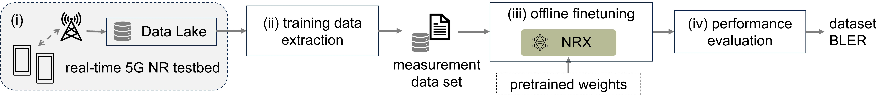

# Site-Specific Training of a Fully-Tunable Neural Receiver (NRX)

The NRX described in [1] and [2] is a standard-compliant 5G NR multi-user MIMO PUSCH receiver from [NVlabs/neural_rx](https://github.com/NVlabs/neural_rx) that implements a convolutional and graph neural network (CGNN) architecture. It processes the received OFDM resource grid, an initial LS channel estimate, and a positional encoding of the DMRS structure.

This codebase is a fork of [NVlabs/neural_rx](https://github.com/NVlabs/neural_rx). It extends the original synthetic-channel workflow with a pipeline that extracts measured PUSCH slot samples from NVIDIA Aerial Data Lake into TensorFlow-compatible TFRecords, finetunes pretrained NRX weights on these datasets, and evaluates the resulting receiver on real-world measurements using the workflow in [3] and [4].

## Requirements

The code was tested with Python 3.10.12. Install the Python dependencies listed in [`requirements.txt`](requirements.txt).

Real-data extraction and evaluation additionally require:

- NVIDIA pyAerial 2025.2.dev1
- NVIDIA Aerial Data Lake release 25-2
- Access to a database containing the `fapi` and `fh` tables
- CUDA toolkit 12.9 and TensorRT 10.3.0

## Steup and Contributions

Experiments are configured through files in [`config/`](config/). The [`nrx_large_3dmrs_13sym1.cfg`](config/nrx_large_3dmrs_13sym1.cfg) pretraining configuration matches the OFDM frame structure used for the measured PUSCH data. Relevant configuration parameters include the number of active uplink layers, number of OFDM symbols, channel model, and number of CGNN iterations.

The NRX is trained with eight CGNN iterations. In this work, the model that evaluates all eight iterations is called the Deep NRX, while the model that evaluates the same weights for two iterations is called the Shallow NRX. This can be adjusted by setting `num_nrx_iter_eval` to 8 or 2, respectively. Other values between 1 and 8 are also supported.

This fork adds the following components to the original workflow:

- [`create_tfrecord_from_data_multicell.py`](scripts/create_tfrecord_from_data_multicell.py) extracts PUSCH measurements from NVIDIA Aerial Data Lake, reconstructs coded-bit labels using the HARQ retransmission history, and writes TensorFlow-compatible datasets to [`/rx_training/finetuning_datasets/`](/rx_training/finetuning_datasets/).
- [`train_neural_rx.py`](scripts/train_neural_rx.py) supports site-specific finetuning from pretrained weights when `channel_type = 'Datalake'` and `datalake_tf_fn` identifies the corresponding TFRecord.
- [`eval_neural_receiver_from_datalake.py`](scripts/eval_neural_receiver_from_datalake.py) uses real-world measurements to evaluate the NRX and the MMSE Reference Rx, which corresponds to the pyAerial PUSCH Rx presented in [5]. It reports dataset BLER and optional BCE statistics. Timestamp files enable deterministic replay.

## Workflow

The complete, command-by-command procedure is provided in the [NRX site-specific training tutorial notebook](notebooks/nrrx_site_specific_training_tutorial.ipynb). All of the datasets can be downloaded from [`datasets.md`](/rx_training/datasets.md), and the configuration files together with the relevant information is detailed in the [Technincal Configurations](#cfg) section.

The workflow is as follows:

0. **Pretrain on synthetic channels.** Train the NRX using [`train_neural_rx.py`](scripts/train_neural_rx.py) with the provided configurations, which use randomized 3GPP UMi channels, and were adapted to be compatible with the data samples collected from the testbed. Alternatively, directly use the provided pretrained weights. Weights use the configuration's `global.label` and are stored under [`weights/`](weights/).
1. **Get real-world measurements.** Ensure that the real-world measurement database is stored in NVIDIA Data Lake. 
2. **Finetuning data extraction.** Use the ClickHouse-backed Aerial Data Lake extractor [`create_tfrecord_from_data_multicell.py`](scripts/create_tfrecord_from_data_multicell.py) to write a TensorFlow-compatible TFRecord file that is stored in [`/rx_training/finetuning_datasets`](../finetuning_datasets/). The extractor uses HARQ retransmissions to reconstruct labels for failed transmissions. Alternatively, directly use the provided extracted TFRecord files detailed in the [Technincal Configurations](#cfg) section.
3. **Offline finetuning.** Run the training script [`train_neural_rx.py`](scripts/train_neural_rx.py) with a configuration which has `channel_type = 'Datalake'` and sets `datalake_tf_fn` to an existing TFRecord. Mixed single-/dual-layer experiments can use a list of compatible TFRecords. Finetuning starts from the selected pretrained weights and writes a new label-specific weight set. Note that with the current implementation, pretrained weights must manually be copied over for finetuning.
4. **Performance evaluation.** Use the same configuration files to export the finetuned model to ONNX and compile a TensorRT `.plan` engine using [`export_onnx.py`](scripts/export_onnx.py). Evaluate the model using the [`eval_neural_receiver_from_datalake.py`](scripts/eval_neural_receiver_from_datalake.py) script. Select the matching database and optionally, for reproducibility, the timestamp file, then analyze the NRX performance.

## Technical Configurations

All the measurement campaigns, respective databases, finetuning TFRecords, and finetuning / test splits used in the experiments are documented in [`datasets.md`](../datasets.md).

The `--db` argument of [`eval_neural_receiver_from_datalake.py`](scripts/eval_neural_receiver_from_datalake.py) selects the corresponding Data Lake database. To reproduce a reported experiment, use the matching configuration and timestamp file from [`datasets.md`](/rx_training/datasets.md).

The tables below detail the relevant configuraiton files found in [`config`](config/), the TFRecord file used for finetuning, and the timestamps used for evaluation for each of the documented NRX experiments.

#### Pretraining

| Receiver | Nr. of Iterations | Configuration | Channel Model |
| --- | --- | --- | --- |
| Deep NRX | 8 | [`nrx_large_3dmrs_13sym1.cfg`](neural_rx/config/nrx_large_3dmrs_13sym1.cfg) | 3GPP UMi |
| Shallow NRX | 2 | [`nrx_large_3dmrs_13sym1_2.cfg`](neural_rx/config/nrx_large_3dmrs_13sym1_2.cfg) | 3GPP UMi |

The same pretrained weights can be evaluated with different iteration counts ranging from 1 to 8.

#### Finetuning and Evaluation

| Dataset | Finetuning Configuration | Finetuning TFRecord(s) | Evaluation Timestamps |
| --- | --- | --- | --- |
| Small Laboratory Nov. 2025 (1 ULL) | Deep: [`nrx_datalake_novj61.cfg`](/neural_rx/config/nrx_datalake_novj61.cfg) Shallow: [`nrx_datalake_novj61_rt.cfg`](/neural_rx/config/nrx_datalake_novj61_rt.cfg) | [`nrx_measurement_2025_11_03.tfrecord`](https://iis-people.ee.ethz.ch/~iisdatasets/iip/site_specific_training/finetuning_datasets/indoor_lab/nov_25/tfrecord/nrx_measurement_2025_11_03.tfrecord) | [`timestamps_novj61_ue1.pkl`](https://iis-people.ee.ethz.ch/~iisdatasets/iip/site_specific_training/finetuning_datasets/indoor_lab/nov_25/timestamps/timestamps_novj61_ue1.pkl) |
| Small Laboratory Jun. 2026  (1 ULL) | Deep: [`nrx_datalake_junj61_1ULL.cfg`](/neural_rx/config/nrx_datalake_junj61_1ULL.cfg) Shallow: [`nrx_datalake_junj61_1ULL_rt.cfg`](/neural_rx/config/nrx_datalake_junj61_1ULL_rt.cfg) | [`sgs23_1ULLs_5dB_j61_2026_06_04.tfrecord`](https://iis-people.ee.ethz.ch/~iisdatasets/iip/site_specific_training/finetuning_datasets/indoor_lab/jun_26/tfrecord/sgs23_1ULLs_5dB_j61_2026_06_04_cell_id_51_no.tfrecord) | [`timestamps_junj61_1ULL.pkl`](https://iis-people.ee.ethz.ch/~iisdatasets/iip/site_specific_training/finetuning_datasets/indoor_lab/jun_26/timestamps/timestamps_junj61_1ULL.pkl) |
| Small Laboratory Jun. 2026  (2 ULL) | Deep NRX: [`nrx_datalake_junj61_2ULL.cfg`](/neural_rx/config/nrx_datalake_junj61_2ULL.cfg) Shallow NRX: [`nrx_datalake_junj61_2ULL_rt.cfg`](/neural_rx/config/nrx_datalake_junj61_2ULL_rt.cfg) | [`Pixel9Pro_2ULLs_12dB_j61_2026_06_04.tfrecord`](https://iis-people.ee.ethz.ch/~iisdatasets/iip/site_specific_training/finetuning_datasets/indoor_lab/jun_26/tfrecordPixel9Pro_2ULLs_12dB_j61_2026_06_04_cell_id_51_no.tfrecord) | [`timestamps_junj61_2ULL.pkl`](https://iis-people.ee.ethz.ch/~iisdatasets/iip/site_specific_training/finetuning_datasets/indoor_lab/jun_26/timestamps/timestamps_junj61_2ULL.pkl) |
| Small Laboratory Jun. 2026  (1+2 ULL) | Deep NRX: [`nrx_datalake_junj61_mixed.cfg`](/neural_rx/config/nrx_datalake_junj61_mixed.cfg) Shallow NRX: [`nrx_datalake_junj61_mixed_rt.cfg`](/neural_rx/config/nrx_datalake_junj61_mixed_rt.cfg) | [`[sgs23_1ULLs_5dB_j61_2026_06_04.tfrecord`](https://iis-people.ee.ethz.ch/~iisdatasets/iip/site_specific_training/finetuning_datasets/indoor_lab/jun_26/tfrecord/sgs23_1ULLs_5dB_j61_2026_06_04_cell_id_51_no.tfrecord), [`Pixel9Pro_2ULLs_12dB_j61_2026_06_04.tfrecord]`](https://iis-people.ee.ethz.ch/~iisdatasets/iip/site_specific_training/finetuning_datasets/indoor_lab/jun_26/tfrecordPixel9Pro_2ULLs_12dB_j61_2026_06_04_cell_id_51_no.tfrecord) | [`timestamps_junj61_1ULL.pkl`](https://iis-people.ee.ethz.ch/~iisdatasets/iip/site_specific_training/finetuning_datasets/indoor_lab/jun_26/timestamps/timestamps_junj61_1ULL.pkl)  [`timestamps_junj61_2ULL.pkl`](https://iis-people.ee.ethz.ch/~iisdatasets/iip/site_specific_training/finetuning_datasets/indoor_lab/jun_26/timestamps/timestamps_junj61_2ULL.pkl) |
| Large Office Floor Nov. 2025 (1 ULL) | Deep NRX: [`nrx_datalake_novjfloor.cfg`](/neural_rx/config/nrx_datalake_novjfloor.cfg) Shallow NRX: [`nrx_datalake_novjfloor_rt.cfg`](/neural_rx/config/nrx_datalake_novjfloor_rt.cfg) | [`nrx_jfloor_1st_2025_12_02.tfrecord`](https://iis-people.ee.ethz.ch/~iisdatasets/iip/site_specific_training/finetuning_datasets/indoor_floor/nov_25/tfrecord/nrx_jfloor_1st_2025_12_02_cell_id_51.tfrecord) | [`timestamps_novjfloor_ue1.pkl`](https://iis-people.ee.ethz.ch/~iisdatasets/iip/site_specific_training/finetuning_datasets/indoor_floor/nov_25/timestamps/timestamps_novjfloor_ue1.pkl) |
| Nov. 2025 Outdoor (1 ULL) | Deep: [`nrx_datalake_drone.cfg`](/neural_rx/config/nrx_datalake_drone.cfg) Shallow: [`nrx_datalake_drone_rt.cfg`](/neural_rx/config/nrx_datalake_drone_rt.cfg) | [`nrx_drone_2025_12_03.tfrecord`](https://iis-people.ee.ethz.ch/~iisdatasets/iip/site_specific_training/finetuning_datasets/outdoor_uav/nov_25/tfrecord/nrx_drone_2025_12_03_cell_id_51_273prb.tfrecord) | [`timestamps_drone3.pkl`](https://iis-people.ee.ethz.ch/~iisdatasets/iip/site_specific_training/finetuning_datasets/oudoor_uav/nov_25/timestamps/timestamps_drone3.pkl) |
<!-- | Jun. 2026 Large Office Floor (1 ULL) | Deep: [`nrx_datalake_junjfloor_1ULL.cfg`](neural_rx/config/nrx_datalake_junjfloor_1ULL.cfg) Shallow: [`nrx_datalake_junjfloor_1ULL_rt.cfg`](neural_rx/config/nrx_datalake_junjfloor_1ULL_rt.cfg) | `sgs23_1ULLs_5dB_jFloorRealLoop_2026_06_10.tfrecord` | [`timestamps_junjfloor_1ULL.pkl`](neural_rx/eval_timestamps/timestamps_junjfloor_1ULL.pkl)  |
| Jun. 2026 Large Office Floor (2 ULL) | Deep: [`nrx_datalake_junjfloor_2ULL.cfg`](neural_rx/config/nrx_datalake_junjfloor_2ULL.cfg) Shallow: [`nrx_datalake_junjfloor_2ULL_rt.cfg`](neural_rx/config/nrx_datalake_junjfloor_2ULL_rt.cfg) | `Pixel9Pro_2ULLs_12dB_jFloorRealLoop_2026_06_10.tfrecord` | [`timestamps_junjfloor_2ULL.pkl`](neural_rx/eval_timestamps/timestamps_junjfloor_2ULL.pkl) |
| Jun. 2026 Large Office Floor (1+2 ULL) | Deep: [`nrx_datalake_junjfloor_mixed.cfg`](neural_rx/config/nrx_datalake_junjfloor_mixed.cfg) Shallow: [`nrx_datalake_junjfloor_mixed_rt.cfg`](neural_rx/config/nrx_datalake_junjfloor_mixed_rt.cfg) | `[sgs23_1ULLs_5dB_jFloorRealLoop_2026_06_10.tfrecord, Pixel9Pro_2ULLs_12dB_jFloorRealLoop_2026_06_10.tfrecord]` | [`timestamps_junjfloor_1ULL.pkl`](neural_rx/eval_timestamps/timestamps_junjfloor_1ULL.pkl)  [`timestamps_junjfloor_2ULL.pkl`](neural_rx/eval_timestamps/timestamps_junjfloor_2ULL.pkl) | -->

## Repository Map

- [`config/`](config/): configurations which are used for synthetic pretraining, site-specific finetuning, and model export.
- [`scripts/`](scripts/): scripts for training, finetuning data extraction, model export, and real-world data evaluation.
- [`utils/`](utils/): model definitions, channel providers, parameter handling, and export helpers.
- [`notebooks/`](notebooks/): tutorial notebooks, including the [site-specific training tutorial](notebooks/nrrx_site_specific_training_tutorial.ipynb).
- [`weights/`](weights/): pretrained and finetuned NRX weights.
- [`onnx_models/`](onnx_models/): exported ONNX models and TensorRT engines.
- [`eval_timestamps/`](eval_timestamps/): timestamps used for deterministic evaluation.
- [`logs/`](logs/), [`results/`](results/), and [`plots/`](plots/): training logs, evaluation outputs, and result figures.

## References

[1] S. Cammerer, F. Aït Aoudia, J. Hoydis, A. Oeldemann, A. Roessler, T. Mayer, and A. Keller, “A Neural Receiver for 5G NR Multi-user MIMO,” in *Proc. IEEE Global Communications Conference Workshops (GLOBECOM Workshops)*, 2023, available at https://arxiv.org/abs/2312.02601

[2] R. Wiesmayr, S. Cammerer, F. Aït Aoudia, J. Hoydis, J. Zakrzewski, and A. Keller, “Design of a Standard-Compliant Real-Time Neural Receiver for 5G NR,” arXiv:2409.02912, Sep. 2024, available at https://arxiv.org/abs/2409.02912

[3] N. B. Baytekin, R. Wiesmayr, S. Cammerer, C. Dick, and C. Studer, “Site-Specific Finetuning of Neural Receivers with Real-World 5G NR Measurements,” arXiv:2603.09644, Mar. 2026, available at https://arxiv.org/abs/2603.09644

[4] R. Wiesmayr, N. B. Baytekin, C. Dick, and C. Studer, “On the Impact of Site-Specific Training for a Real-World 5G NR System,” in *Proc. Asilomar Conference on Signals, Systems, and Computers*, 2026. Available: https://arxiv.org/abs/2609.04004

[5] NVIDIA Corporation, “Aerial CUDA-Accelerated RAN,” release 25-2, available at https://docs.nvidia.com/aerial/cuda-accelerated-ran/25-2/index.html
